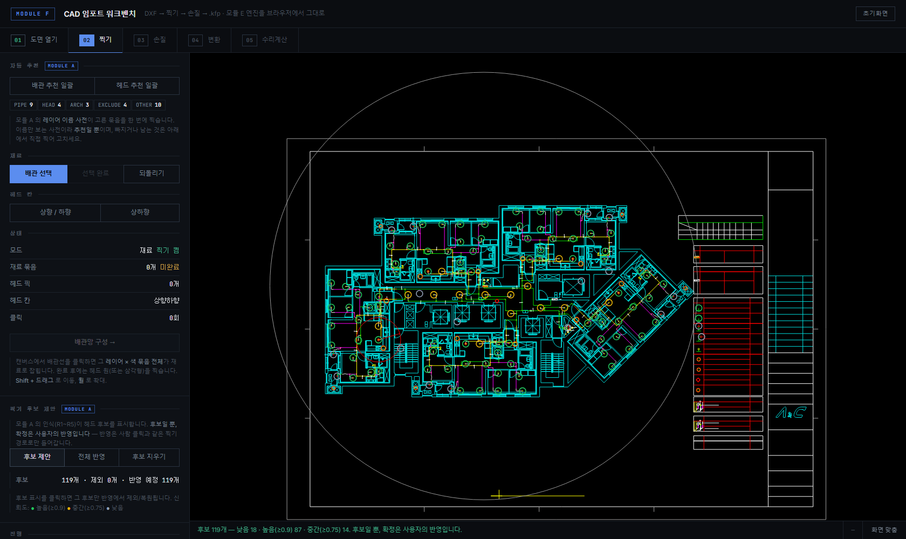
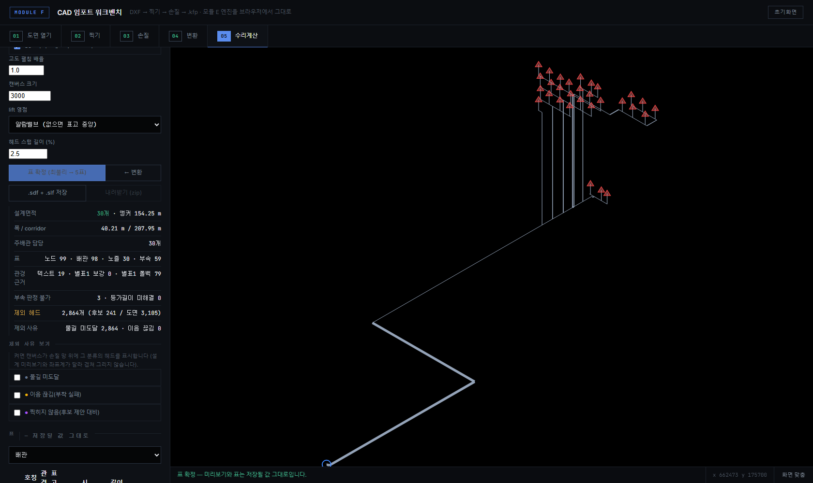
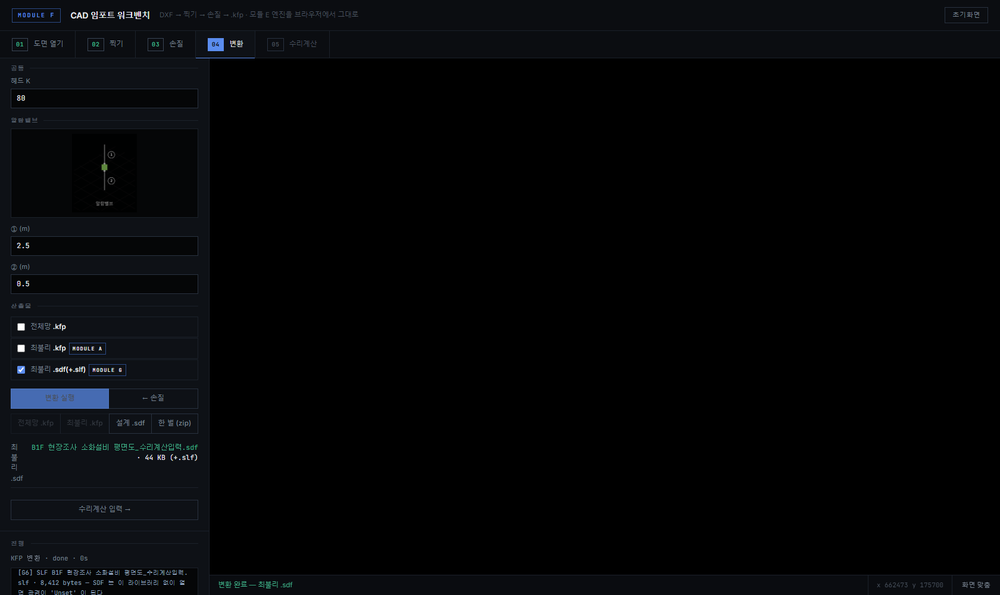

# 완성품 모듈 F — 웹 워크벤치

> ModuleF_완성_작업지시서 §F-0~F-6 의 구현 기록. 항목당 커밋 1개.
> *브라우저 하나로 도면 열기 → 사람 확정 → 최불리 → kfp/sdf 까지* — E 의 판단
> 철학과 A 의 증거 추출과 G 의 수리계산 입력 엔진을 모두 태운 것.

## 흐름

```
01 도면 열기 ─ DXF 업로드(open) 또는 저장본(reopen)
02 찍기     ─ 재료(레이어×색) · 헤드(문양 서명) 확정
             └ [D2] 모듈 A 인식(R1~R5)이 후보 «제안» — 반영은 사람 클릭 API 로만
03 손질     ─ 물흐름 · 자동 이음(A 실측 여유 + E 판정) · 급수원/알람밸브
04 변환     ─ [D3] 산출 3종 체크: 전체망 .kfp / 최불리 .kfp / 최불리 .sdf
05 수리계산 ─ [G16 웹판] 설정 7종 · 아이소 미리보기 · 표 4종 · .sdf+.slf 저장
```

## 모듈 관계 (D1)

| 모듈 | 관계 | 내용 |
|---|---|---|
| **G** (`cad_project_editor_g/`) | **문다** | 엔진 전부 — 찍기/손질/변환 파사드 + `design/`(최불리·관경·부속·SDF). F 는 여기서만 import 한다 |
| **A** (`remote30_prototype.py`) | 빌린다(읽기 전용) | 레이어 사전 · 도면 장 나누기 · `detect_heads`(후보 제안) |
| **E** (`cad_project_editor/`) | **동결** | 레퍼런스로 은퇴. 웹 프로세스 sys.path 에 절대 오르지 않는다(`_boot` 가 세운다) |

## API (전부 `/api/module-f/*`)

| 단계 | 엔드포인트 | 요지 |
|---|---|---|
| 열기 | `POST open` · `POST reopen` · `GET saved` · `GET world` | 업로드/저장본 → 찍기·손질 세션 |
| 잡 | `GET job` · `GET job/stream` | 폴링(하위호환) · **SSE**(F-6) |
| 찍기 | `POST pick/mode·click·auto·undo·commit` | E 의 확정 게이트 그대로 |
| 제안 | `POST pick/suggest` | A 인식 후보(신뢰도) — **board 불변**, 반영은 pick/click 로만 (F-5) |
| 손질 | `POST edit/mode·click·flow·autojoin/*·undo` | 물흐름·자동 이음 |
| 최불리 | `POST edit/worst` | **급수원 지정 규약**(F-1·D4): 2곳 이상이면 `source_selection_required` + 후보(Z1…) |
| 설계 | `POST design/build` · `GET design/preview` · `POST design/emit` | G design/ 그대로 (F-2). preview 좌표 == 저장 Position |
| 변환 | `POST convert/run` (`outputs` 3종) · `GET convert/result` | 8조합 각각 «정확히 그 파일만» (F-4) |
| 받기 | `GET download?what=kfp·worst-kfp·design·set` | 최불리 .kfp 는 `_최불리K<n>` 파일명 |

## 설계(수리계산) 설정 7종

| 설정 | 기본 | 비고 |
|---|---|---|
| 기준개수 K | 30 | NFPC 103 |
| 배관 규격 기본값 | KSD 3507 | SLF Item-name 과 철자·공백 동일해야 바인딩 |
| 아이소매트릭 | 켬 | 표시 전용 |
| 고도 펼침 배율 | 1.0 | 표시 전용 |
| 캔버스 크기 | 3000 | 표시 전용 |
| lift 영점 | 알람밸브 | 없으면 표고 중앙 |
| 헤드 스텁 길이 | 2.5 % | 표시 전용 (G15) |

세션에 기억된다(B3 — 프로젝트 저장 여부는 미결).

## 결정 기록 (커밋)

| 항목 | 커밋 | 결정·근거 |
|---|---|---|
| F-0 엔진 재지정 | `d2bb0ac` | EDITOR_ROOT→G · 작업폴더 1회 이관(충돌 4건 보고만) · E path 오염 가드 · 잡 러너 SystemExit 무한 «run» 수리 |
| F-1 급수원 규약 | `7cdbd5e` | worst_k_heads(source_index) — 유일한 엔진 변경. None 비트동일을 변경 전 함수와 나란히 증명. **새 기준선**: B1F·Z1 far 154.25 m (board 19040/18918/3105) |
| F-2 design HTTP | `ffa283c` | build/preview/emit — G 데스크톱 4번째 창과 label 정규화 후 바이트 동일(B7 만큼만 정규화) |
| F-3 수리계산 패널 | `68db68f` | G16 웹판. IIFE 스코프 밖 JS 회귀를 브라우저 검증이 잡음 |
| F-4 산출 3종 | `b391fa8` | 전체망/최불리 kfp + 설계 sdf. `_emit_pipenet`(전체망 문법 재직렬화) 은퇴 |
| F-5 후보 제안·계측 | `5b43165` | 제안은 board 불변·반영은 클릭 API. 찍기는 «문양 서명» 토글 — 취소면 되클릭 복원. 제외 3분류(미도달/이음 끊김/미찍힘) |
| F-6 SSE | `247456e` | job/stream + EventSource 폴백. 폴링 유지 |

## 검증 체계

- `tests/test_module_f_design.py` (F-2·F-3) · `tests/test_module_f_outputs.py`
  (F-4 8조합) · `tests/test_module_f_suggest.py` (F-5) ·
  `tests/test_module_f_complete.py` (F-7 골든 — B1F 기준선 + 대명동 전 구간,
  board 지문으로 입력 표류를 코드 회귀와 갈라 말한다)
- `scripts/_verify_module_f.py` (테스트 클라이언트 4단) ·
  `scripts/_verify_module_f_browser.py` (Playwright — 콘솔 오류 0 규약) ·
  `scripts/_verify_module_f_source.py` (F-1 규약)
- `tests/smoke/test_module_f_engine.py` — services 실체가 G 트리인지 못박는다
- G 테스트(`cad_project_editor_g/tests/`) = F 엔진 테스트 (같은 엔진)

## 화면


*모듈 A 인식 후보 119개(신뢰도 색). 후보일 뿐 — 확정은 사용자의 반영.*


*설정 7종 + 요약 + 아이소매트릭 미리보기(저장 좌표 그대로).*


*전체망 .kfp · 최불리 .kfp(K30) · 최불리 .sdf(+.slf).*

PIPENET 화면 캡처는 이 환경에서 그 프로그램을 띄울 수 없어 내지 못했다 — 대신
Type/Diameter/User-lib/DOCTYPE 를 파일에서 직접 세는 검사가 골든에 있다
(`_sdf_invariants`). G18 과 같은 대체 방식이다.

## 남은 미결 (BLOCKED)

B1 corridor 뿌리 · B3 K 저장 위치 · B7 배관 id 비결정 · B8 배관별 관종 ·
B12 헤드 대량 제외 원인 · B13 헤드 접속관 규격 · G 데스크톱 처분(신규) —
저장소 루트 `BLOCKED.md` 와 `cad_project_editor_g/BLOCKED.md` 참조.
