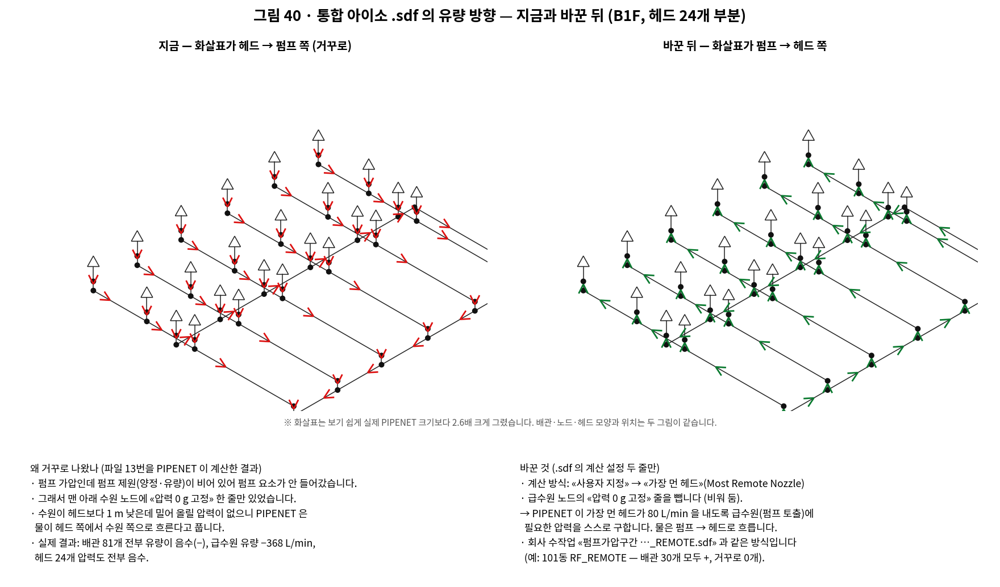
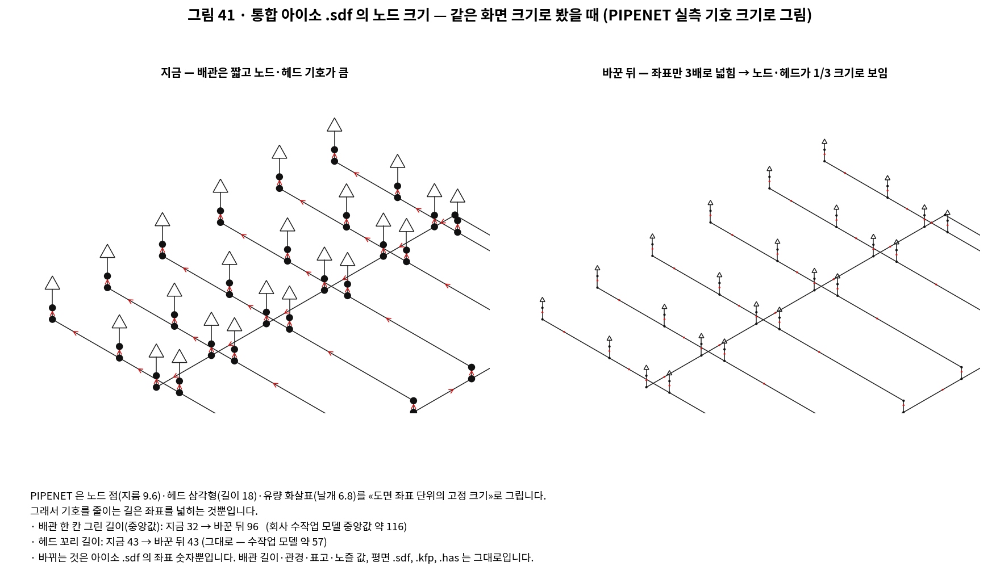

# 통합 .sdf — 유량 방향(펌프 → 헤드)과 아이소 노드 크기 (오너 2026-09-22)

오너 지시: «모듈F 통합으로 출력한 B1F 도면의 .sdf 파일의 아이소매트릭의 유량의 방향이
반대로 되어있는 것 같은데? 펌프에서 시작해서 각 말단 헤드의 방향으로 유량이 나아가야
하는데 … 그리고 파이프넷 아이소매트릭의 노드의 크기가 너무 커서 보기가 안좋아.»

## ① 유량 방향 — 펌프 제원 없는 펌프 가압은 «가장 먼 헤드» 방식으로 저장

- **원인**: 급수방식 «펌프 가압» 인데 화면이 펌프 제원(정격 유량·양정)을 보내지 않아
  `merge_network` 가 펌프 요소를 넣지 않는다(`if is_pump and pump:`). 그러면 .sdf 에는
  맨 아래 수원 노드의 `<Calculation-spec pressure="101325"/>`(0 g 고정) 한 줄만 남는다.
  수원이 헤드보다 낮은데 밀어 올릴 압력이 없으니 PIPENET 은 헤드 → 수원으로 흐른다고 푼다.
  실측(B1F, 파일 13번의 PIPENET 결과 .xml): 배관 81개 전부 유량 음수, 급수원 유량
  −368 L/min, 헤드 24개 압력 전부 음수.
- **조치**: 통합 산출 API 가 «펌프 가압 **이고** 결합망에 펌프가 없을 때»만
  `emit_merged(remote_nozzle=True)` 로 부른다. 평면·아이소 .sdf 두 벌에서
  - `Design-options` 의 `specification-type` 을 `remote-nozzle` 로,
  - 급수원(Input) 노드의 `Calculation-spec` 한 줄을 뺀다(`Nozzle-specification` 자리표시도 뺀다).
  PIPENET 은 가장 먼 헤드가 제 유량을 내도록 급수원(펌프 토출)에 필요한 압력을 스스로
  구한다(Spray 매뉴얼 19.1 «Most Remote Nozzle»: I/O 노드가 하나면 다른 지정이 필요 없다).
  0유량 출구로 막은 끝(Output, `flow="0"`)은 그대로 둔다 — 지정 수 = I/O 노드 수 − 1.
- **근거**: 회사 수작업 «…펌프가압구간 …_REMOTE.sdf» 가 같은 꼴이다(펌프 요소 없음 ·
  급수원 지정 없음 · `remote-nozzle`). 예: 101동 펌프가압구간 RF_REMOTE 의 PIPENET 결과는
  배관 30개 모두 양(+), 급수원 압력은 PIPENET 이 계산.
- **안 바뀌는 것**: KFP·HAS 는 바꾸기 **전** 파일로 이미 만든 뒤라 바이트까지 같다.
  펌프 제원을 넣어 펌프 요소가 들어간 망, 고가수조·감압 방식은 종전 그대로다.
  망이 가지 모양(루프 없음)이고 모든 헤드가 물을 내므로 모든 배관의 흐름은 펌프에서
  멀어지는 쪽이다 — 배관의 입력 노드가 상류라는 규약을 이미 지키고 있어 화살표가
  배관 방향과 같다.

## ② 아이소 노드 크기 — 아이소 .sdf 좌표만 3배

- **원인**: PIPENET 은 노드 점(지름 9.59)·헤드 삼각형(18 × 10)·유량 화살표(날개 6.76)를
  **도면 좌표 단위의 고정 크기**로 그린다(`core/d_iso_renderer.py` 실측 상수). 통합 아이소의
  배관 한 칸은 그린 길이 중앙값 32(B1F)로 수작업 모델(약 116)보다 3배 이상 짧았다.
- **조치**: `emit_merged(iso_spread=ISO_SPREAD)` — 아이소 .sdf 를 같은 표·같은 함수로,
  표시 배율만 3배로 한 번 더 쓴다. 노즐 꼬리 비율은 1/3 로 줄여 꼬리 길이(43)는 그대로다.
  모양(방향·비율)은 그대로, 배관은 32 → 96, 노드·헤드·화살표는 1/3 크기로 보인다.
- **안 바뀌는 것**: 평면 .sdf, .kfp, .has(아이소 .has 도 넓히기 전 좌표로 만든다), 배관
  길이·관경·표고·노즐 값. 배수는 `routes/module_f/emit.py` 의 `ISO_SPREAD` 한 곳이다.

## 시험

`tests/test_module_f_merged_iso_remote.py` — 계산 방식·급수원 지정만 바뀌는지, 좌표 3배
(유효숫자 6자리 반올림 허용)와 꼬리 길이 유지, KFP·HAS·평면 .sdf 바이트 동일, 펌프가
있거나 급수원이 둘인 망은 바꾸지 않고 사유를 남기는지, 산출 API 가 규칙대로 부르는지.
