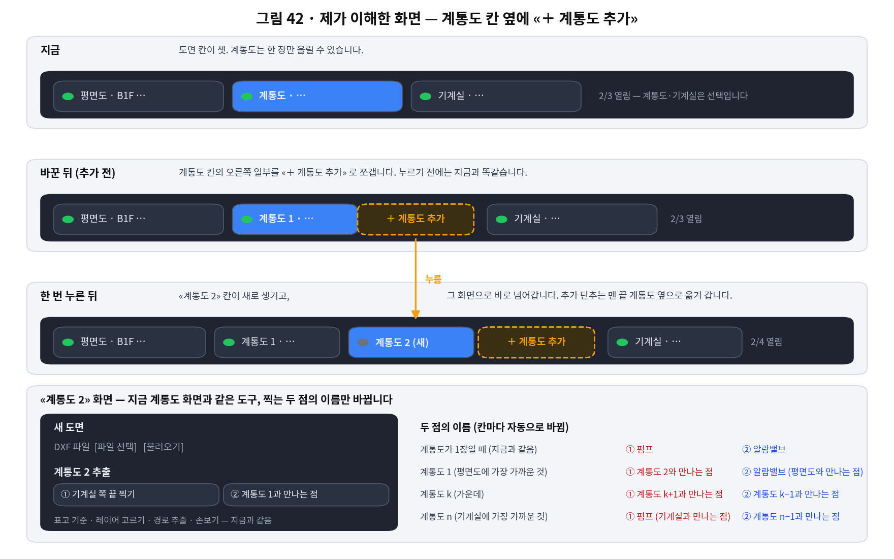
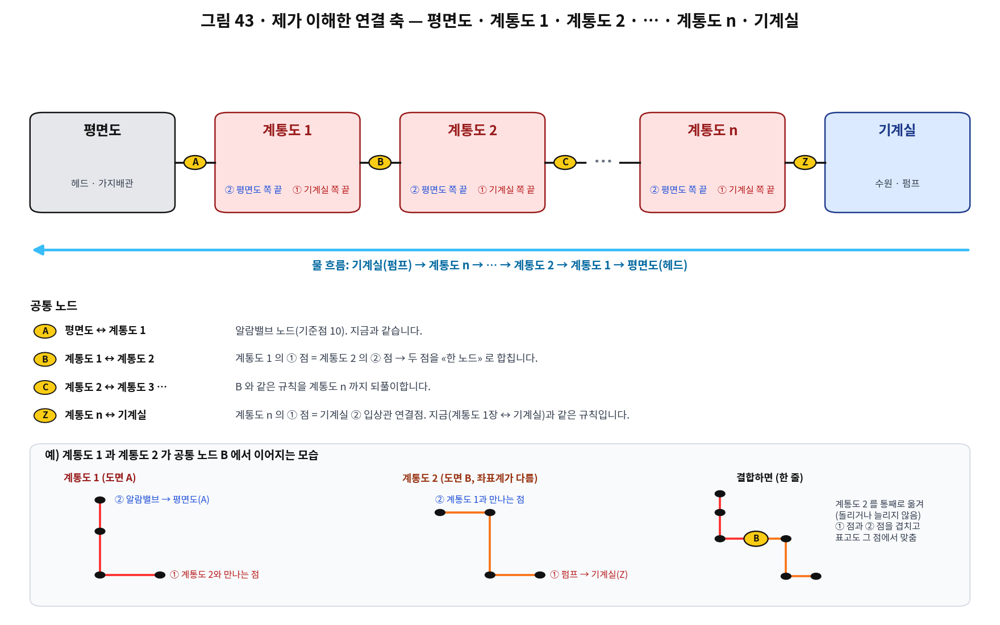
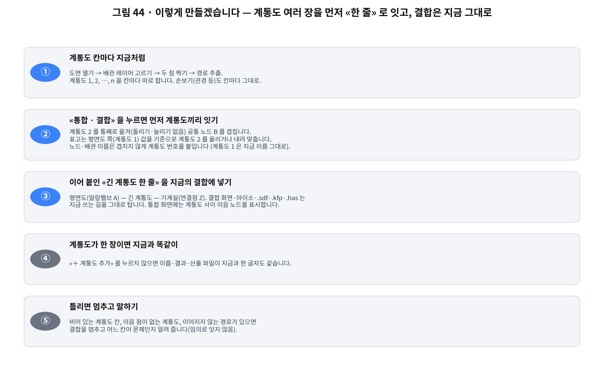
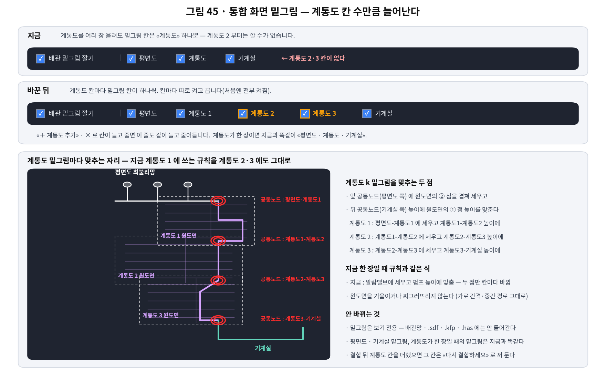
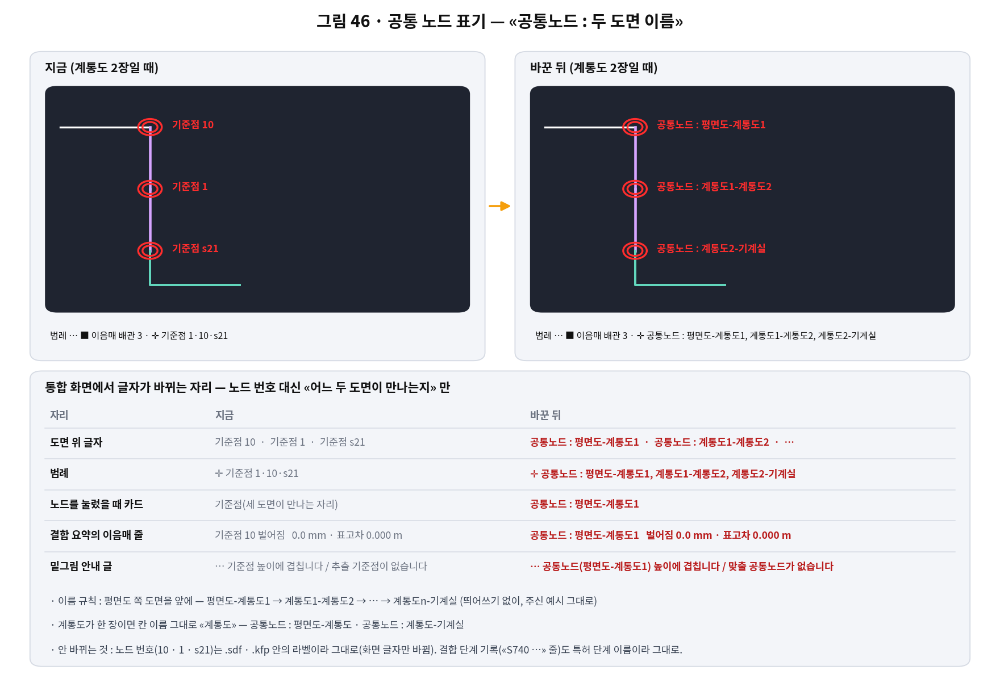

# 계통도 여러 장 — «＋ 계통도 추가» (오너 2026-09-22)

오너 지시: «모듈 F 의 계통도의 역할은 평면도의 배관망과 기계실의 배관망을 이어주는 것 …
하나의 계통도만으로 제대로 된 경로를 이끌지 못할 수도 있어 … «계통도 추가» 를 누르면
새로운 계통도 파트 스크린이 나오도록 … 연결되는 공통 노드의 연결축은
평면도-계통도1-계통도2-계통도n-기계실». 구현 전 그림 42~44 로 이해를 확인받았다
(승인: 이대로 진행 · 이음 표고는 앞 계통도 기준 · 더한 칸에 × 지우기).

## 화면

- 칸 줄: 계통도 칸 옆을 쪼갠 **«＋ 계통도 추가»**. 누르면 기계실 쪽 끝에 빈 계통도 칸이
  생기고 그 칸으로 넘어간다(`/api/module-f/slot/add-system` → `/slot/switch`).
  추가 단추는 늘 맨 끝 계통도 옆에 붙는다. 더한 칸에만 **×**(확인 후 지움 ·
  `/slot/remove-system`). 계통도 1 은 지울 수 없다. 최대 10장.
- 칸 이름은 자리로 매긴다 — 한 장이면 종전 그대로 «계통도», 여러 장이면 «계통도 1 · 2 …».
  칸 id 는 `system`(계통도 1) · `system2` · `system3` … 이고 지운 칸 뒤는 이름이 당겨진다.
- 각 계통도 칸은 지금 계통도 화면과 같은 도구다(도면 열기 · 레이어 · ★추적 · 두 점 · 추출 ·
  손보기). 두 점의 이름만 자리를 따른다 — ① 기계실 쪽 끝 · ② 평면도 쪽 끝:

  | 칸 | ① | ② |
  |---|---|---|
  | 한 장뿐 (종전) | 펌프 | 알람밸브 |
  | 계통도 1 | 계통도 2와 만나는 점 | 알람밸브 (평면도와 만나는 점) |
  | 계통도 k | 계통도 k+1과 만나는 점 | 계통도 k−1과 만나는 점 |
  | 계통도 n | 펌프 (기계실과 만나는 점) | 계통도 n−1과 만나는 점 |

- 통합 준비표는 계통도 칸마다 «있음/없음» 을 따로 말하고, 경로가 없는 칸이 있으면
  결합하지 않고 그 칸 이름을 알려 준다.

## 결합 (`routes/module_f/system_chain.py`)

결합(`merge_network`) **앞** 에서 계통도들을 한 줄로 잇고, 그 뒤는 지금 길 그대로다.

- 계통도 k 의 ① 점(`input_node_label`) = 계통도 k+1 의 ② 점(`av_node_label`) → 한 노드.
- 계통도 k+1 을 통째로 **평행이동**해 그 점을 겹친다(돌리기·늘리기 없음 — 도면 모양과
  배관 길이 그대로).
- 표고는 **앞(평면도 쪽) 계통도 기준** — 뒤 계통도 전체를 올리거나 내려 공통 노드 표고를
  맞추고, 옮긴 양을 단계 기록에 남긴다(예: «계통도 2 표고 −1.500 m 맞춤»).
- 계통도 2 부터 노드·배관 이름 앞에 `s<k>`(예: `r3` → `s2r3`). PIPENET 라벨은 영문자로
  시작하고 영문자·숫자만 쓸 수 있어(Spray 매뉴얼 4.3) 밑줄을 쓰지 않는다. 계통도 1 은
  지금 이름 그대로.
- 급수원(Input)은 계통도 n 의 ① 점으로 옮겨 가고, 기계실은 거기에 붙는다(종전 규칙).
- 단면(x·표고) 계통도끼리면 모드를 그대로, 섞이면 단면 쪽 y 를 0 으로 펴서 잇는다.
- 통합 화면은 계통도 사이 공통 노드를 이음매(기준점과 같은 표시)로 그린다.
- 계통도가 한 장이면 받은 것을 그대로(같은 객체) 넘긴다 — 결과·산출이 종전과 같다.

## 통합 화면 — 계통도마다 밑그림 · 공통 노드 이름 (오너 2026-09-22 · 그림 45·46)

오너 지시: «통합화면의 계통도 2~이후 밑그림도 입력하는 계통도 수에 따라 추가를 해야지 …
통합하는 공통 노드가 그냥 기준점1, 기준점10 이런식으로 표기되어 있더라고 … "공통 노드"라고
명칭을 통일하고 동시에 어느 도면끼리 공통 노드로 연결되어 있는지만 표기해줘 … "공통노드 :
평면도-계통도1"». 착수 전 그림 45·46 으로 확인받았다(승인: 이대로 진행 — 계통도가 한 장이면
칸 이름 그대로 «계통도»).

### 밑그림 (`routes/module_f/underlays.py` · `static/module_f.js`)

- `reference_layers` 가 칸 줄(`slot_kinds`)을 그대로 돈다 — 평면도 · 계통도 1 … n · 기계실.
  줄 이름도 칸 이름(`slot_label`) 그대로다.
- 계통도 k 를 맞추는 두 점은 **그 계통도의 두 끝이 결합망에서 앉은 자리**다. ② 점 → 앞
  공통 노드(계통도 1 은 라벨 10), ① 점 → 뒤 공통 노드(`chain_joints[k-1]` · 마지막 장은
  기계실이 붙는 자리). 세우는 식(`_upright_reference`)은 한 장일 때와 같다 — ② 점에 겹쳐
  세우고 ① 점 «높이» 에 맞추며, 기울이거나 찌그러뜨리지 않는다.
- 결합 뒤에 더한 계통도 칸은 결합망에 아직 없으므로 «다시 결합하세요» 로 꺼 둔다.
- 화면은 서버가 보낸 줄 수만큼 체크 칸을 짓는다(`syncMergeUnderBoxes`) — 세 칸(평면도 ·
  계통도 · 기계실)은 템플릿에 그대로 있고, 더한 계통도 칸만 계통도 옆에 만들고 지운다.
  칸 id 는 `mg-under-<kind>` 규약 그대로, 색은 계통도 계열이면 계통도 색이다.
- 밑그림은 보기 전용 — 배관망·산출 파일에는 한 좌표도 들어가지 않는다(종전 규약 그대로).

### 공통 노드 이름 (`system_chain.joint_names`)

- «평면도-계통도1 · 계통도1-계통도2 · … · 계통도n-기계실» 이고, 계통도가 한 장이면 칸 이름
  그대로 «평면도-계통도 · 계통도-기계실» 이다(띄어쓰기 없이 — 오너 표기).
- 장 수는 `chain_joints` 수 + 1 로 센다 — 결합 뒤에 칸을 더해도 «지금 보고 있는 그 결합망»
  의 이름이 어긋나지 않는다.
- 쓰는 자리: 도면 위 글자 · 범례(`counts.joints`) · 노드를 눌렀을 때의 카드 · 결합 요약의
  이음매 줄(`checks.anchor_joint`) · 밑그림 안내 글.
- 화면 글자만 바뀐다 — 노드 번호(10 · 1 · s21)는 .sdf · .kfp · .has 안의 라벨이라 그대로고,
  결합 단계 기록(«S740 …» 줄)도 특허 단계 이름이라 그대로 둔다.

## 시험

- `tests/test_module_f_system_chain.py` — 칸 더하기·이름·지우기·상태 독립, 잇기 규칙
  (이름 · 평행이동 · 표고 · 급수원 · PIPENET 라벨), 한 장이면 같은 객체, 결합·산출(KFP ·
  아이소), API(더하기·바꾸기·지우기·준비표·빈 칸 멈춤), 결합 잡 + 화면 이음매.
- `tests/test_module_f_system_chain.py` §5 — 공통 노드 이름(두 장 · 한 장 · 기계실 없음),
  계통도마다 밑그림 줄이 나고 앞·뒤 공통 노드에 맞는다(평면·아이소), 결합 뒤 더한 칸은
  «다시 결합», 화면 API(노드 `joint` · `counts.joints` · `checks.anchor_joint`).
- `tests/test_module_f_system_chain_browser.py` — 칸 줄의 «＋ 계통도 추가» · × · 칸 이름 ·
  두 점 이름(브라우저).
- `tests/test_module_f_merge_joint_browser.py` — 밑그림 칸을 줄 수만큼 짓고 줄면 지우기,
  범례·노드 카드의 «공통노드 : 평면도-계통도1»(브라우저).
- `tests/smoke/route_inventory.json` — 새 라우트 두 줄만 더했다.
