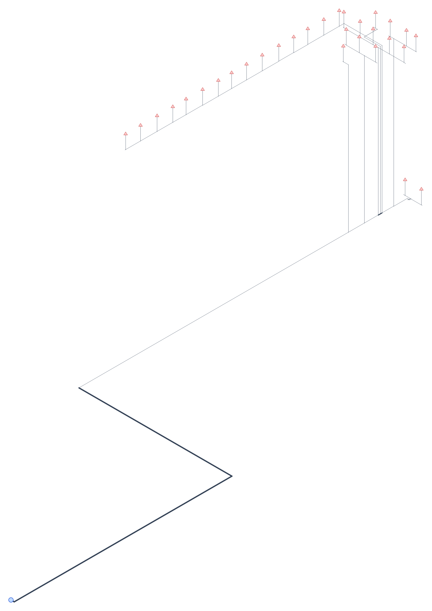
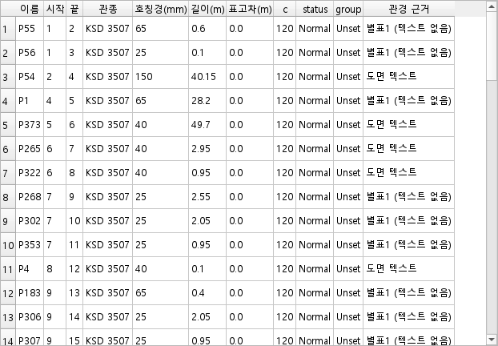

# 모듈 G vs 모듈 A — 최불리 배관망 대조

도면: `B1F 현장조사 소화설비 평면도`

## 왜 숫자가 같기를 기대하지 않는가

두 계통은 **입력이 다르다**. A 는 DXF 엔티티에서 제 그래프를 자동 추출하고,
G 는 사람이 손질한 `EditBoard` 위에서 돈다(모듈 F 와 같은 망). 그래서 대조의
목적은 «같은 값» 이 아니라 «다르면 그 차이가 설명되는가» 다.

## G 결과

- 앵커 좌표 : `(763663.6300352641, 192598.4670836058)`
- 최원 유하거리 : 154.25 m
- 설계면적 폭 : 40.21 m
- corridor 총연장 : 207.95 m
- 주배관 담당 헤드 수(max_load) : 30
- 후보 헤드 : 241 / 도면 3,105
- **전개가 붙이지 못해 제외한 헤드 : 2,864**

## 대조

| 항목 | G | A | 비고 |
|---|---|---|---|
| 선정 방식 | 앵커 (D1) | 먼 순서 (A 기존) | 지시서 D1 이 바꾸라고 한 지점 |
| 선정 헤드 수 | 30 | 30 |  |
| **헤드 퍼짐 (대각, m)** | 29.8 | 134.1 | 작을수록 한 설계구역 — G 가 뭉친다 |
| 앵커 좌표 | (763663.6300352641, 192598.4670836058) | 없음 | A 비-anchored 경로엔 앵커 개념이 없다 |
| 최원 유하거리 (m) | 154.25 | — |  |
| max_load | 30 | — |  |
| corridor 총연장 (m) | 207.95 | 814.29 | A 는 흩어진 30개라 경로가 길다 |
| corridor 간선 수 | — | 148 |  |

## 설명되어야 하는 차이

- **후보 집합** — G 는 전개가 배관에 붙일 수 있는 헤드에서만 고른다
  (BLOCKED B4 1안). B1F 에서 619 / 3,163 이라 A 와 후보 모수가 다르다.
- **망의 출처** — A 는 자동 추출망, G 는 손질망이다. 손질로 이어 붙인
  배관이 있으면 G 쪽 도달 범위가 넓다.
- **corridor 정의** — G 의 `total_m` 은 최단경로 합집합(board 간선)이고,
  전개 배관 길이 합과는 구조적으로 다르다(BLOCKED B5).
- **선정 방식 자체** — A 의 비-anchored 경로는 「급수원에서 먼 순서 K개」다.
  지시서 D1 이 바꾸라고 한 지점이라 **결과가 다른 것이 정상**이다.
  실측 퍼짐이 그 차이를 그대로 보여준다(A 134.1 m vs G 31.4 m).
  A 에도 앵커 경로(`select_worst30_heads_anchored`)가 있으나 알람밸브
  좌표와 헤드 영역이 둘 다 있어야 서고, 이 저장본에는 없어 세우지 못했다.

관경이 다른 간선은 전부 `source`(text / nfpc_min / nfpc_fallback)로
설명되어야 한다. 설명되지 않는 차이가 버그다.

## [G13] SDF 대조 — 같은 도면, 두 계통의 산출

| 항목 | G | A |
|---|---|---|
| Pipe-set 개수 | 7 | 7 |
| 첫 칸이 빈 placeholder | True | True |
| Pipe-type 구성 | (빈칸)(0) / KSD 3507(98) / KSD 3562(0) / KSD 3576(0) / DP(0) / CPVC2(0) / FX(0) | (빈칸)(0) / KSD 3507(148) / KSD 3562(0) / KSD 3576(0) / DP(0) / CPVC2(0) / FX_20A_216(30) |
| 노드 / 배관 / 노즐 | 99 / 98 / 30 | 209 / 178 / 30 |
| 좌표 폭 (x × y) | 3000 × 1118 | 3000 × 1707 |
| 배관 길이 합 (m) | 222.912 | 835.298 |

### 수용 기준

- [PASS] **Pipe-set 구성** — 개수 7 = 7, 첫 칸 빈 placeholder 동일, 라이브러리 6종의 이름·순서 동일: `['KSD 3507', 'KSD 3562', 'KSD 3576', 'DP', 'CPVC2']`.
  마지막 한 칸만 다르다 — G 는 `FX`(빈 정의), A 는 `FX_20A_216`(배관 30). A 는 헤드마다 신축배관을 **실배관으로 펴서** 규격 기하별 Pipe-set 을 동적 생성하고, G 는 그 자리를 노즐 접속으로 둔 채 `FX` 를 드롭다운용 빈 정의로만 싣는다(지시서 G9-1 의 6종). **계산의 차이가 아니라 신축배관을 펴느냐 마느냐의 차이**이며, G 의 FX 실배관화는 이번 지시 범위 밖이다.
- [PASS] **좌표 폭 ±5%** — G 3000 · A 3000 (차이 0.0%). 둘 다 bbox 중심 → (0,0), 긴 축 → 캔버스 단위(3000) 규칙이다.
- [PASS] **위상 불변** — G9 이전(`9d581f8^`) 방출기 산출 `{'nodes': 99, 'pipes': 98, 'nozzles': 30, 'length_sum': 222.912}` / 지금 `{'nodes': 99, 'pipes': 98, 'nozzles': 30, 'length_sum': 222.912}`. 좌표 정규화와 아이소매트릭은 표시만 바꾼다는 증거다.

## [G18] 보정 ② 전후 대조 (지시서 §2 기준선)

이 보정은 표시(SLF 경로·헤드 수직·좌표)와 흐름(산출물 선택)만
건드렸다. 아래가 하나라도 달라지면 위상이나 계산이 흔들린 것이다.

| 항목 | 보정 전(§2) | 보정 후 | |
|---|---|---|---|
| 헤드 | 30 | 30 | 같음 |
| 최원 유하거리 (m) | 154.25 | 154.25 | 같음 |
| 설계면적 폭 (m) | 40.21 | 40.21 | 같음 |
| corridor 총연장 (m) | 207.95 | 207.95 | 같음 |
| 주배관 담당 헤드 수 | 30 | 30 | 같음 |
| 노드 | 99 | 99 | 같음 |
| 배관 | 98 | 98 | 같음 |
| 노즐 | 30 | 30 | 같음 |
| 기기 | 0 | 0 | 같음 |
| 루프 잔여 | 0 | 0 | 같음 |
| 관경 근거 — 도면 텍스트 | 19 | 19 | 같음 |
| 관경 근거 — 별표1 보강 | 0 | 0 | 같음 |
| 관경 근거 — 별표1 폴백 | 79 | 79 | 같음 |
| 부속 | 59 | 59 | 같음 |
| 부속 판정 불가 | 3 | 3 | 같음 |
| 등가길이 미해결 | 0 | 0 | 같음 |

### 화면 증빙

PIPENET 은 이 환경에서 띄울 수 없어 **그 화면 캡처는 내지 못했다.**
대신 두 가지를 낸다.

1. **미리보기 캡처** — 저장될 좌표를 그대로 그린 화면이다. 「미리보기
   좌표 == 저장된 SDF 의 `<Position>`」은 `tests/test_design_dialog.py`
   가 writer 자리수(`.6g`)로 62/62 문자열 일치까지 확인한다. 그래서 이
   그림은 PIPENET 이 그릴 형태와 같은 좌표에서 나온 것이다.
2. **파일 수준 확인** — PIPENET 화면에서 볼 `Type`·`Diameter` 두 열이
   무엇을 보여줄지는 파일에서 직접 셀 수 있다(`tests/test_sdf_post.py`).
   Type 이 빈 배관 0건 · 호칭경이 schedule 에 안 묶인 배관 0건 ·
   User-lib 가 옆의 `.slf` 파일명 하나 · 그 SLF 가 쓰인 호칭경 6종
   (25·40·50·65·100·150)을 전부 정의.

*배관 굵기는 담당 헤드 수에 비례한다. 파란 원이 급수원, 붉은 △ 가 헤드다.*

*`관종` 이 전 행 `KSD 3507`, `호칭경` 이 65/25/150/40 로 채워진다 —
PIPENET 의 `Type`·`Diameter` 열이 보여 줄 값이 이것이다. `관경 근거` 는
이 보정에서 이어 붙인 열이다.*

캡처는 `python tests/_capture_preview.py` 로 다시 만든다.

-> **전부 같다**
